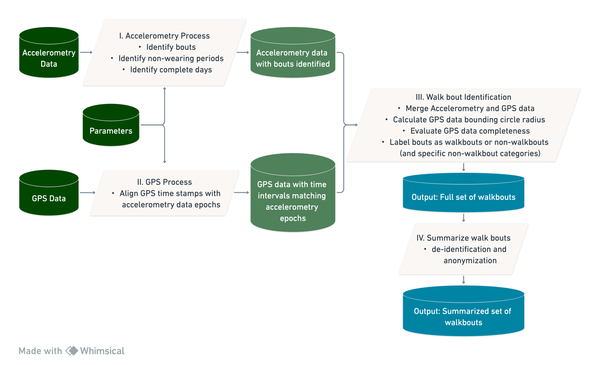
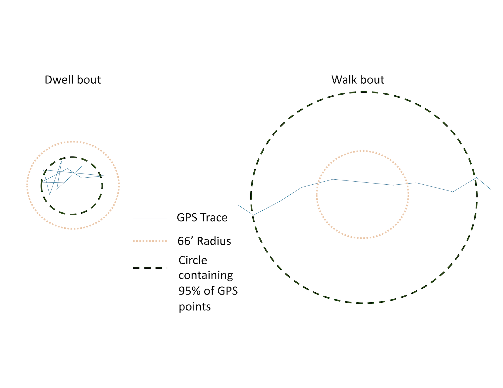
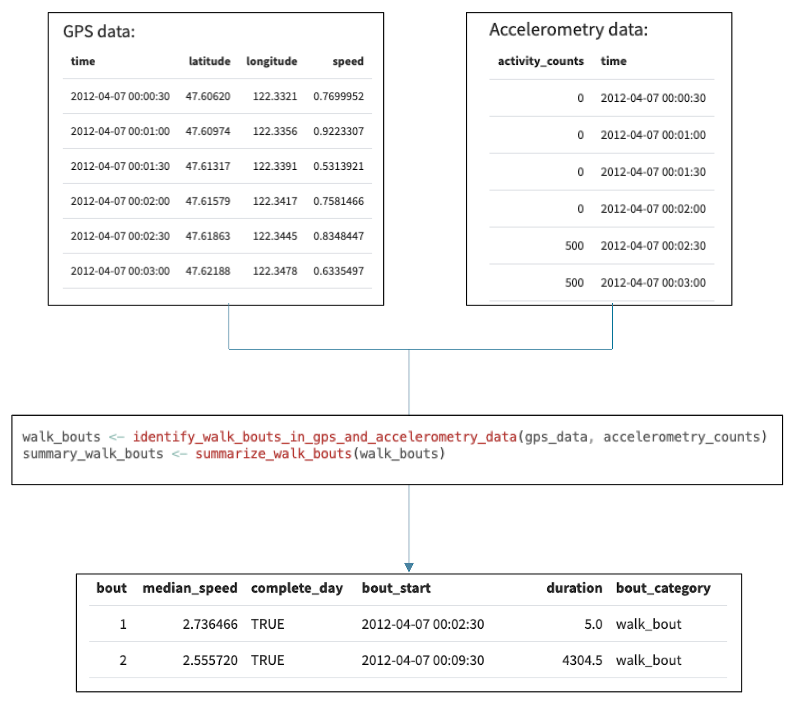
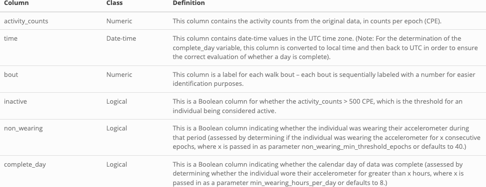
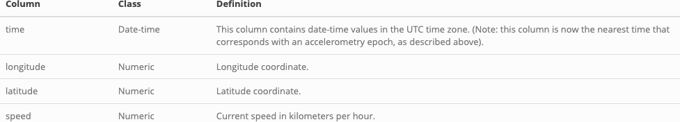
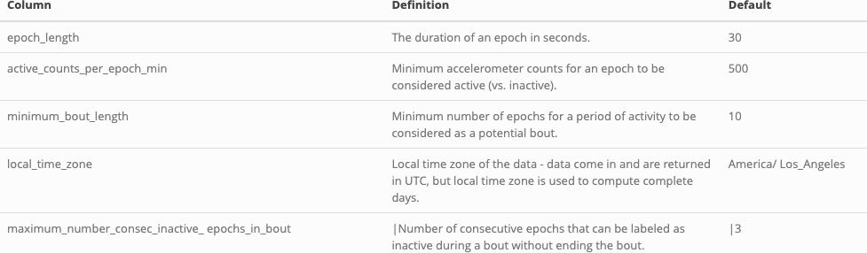
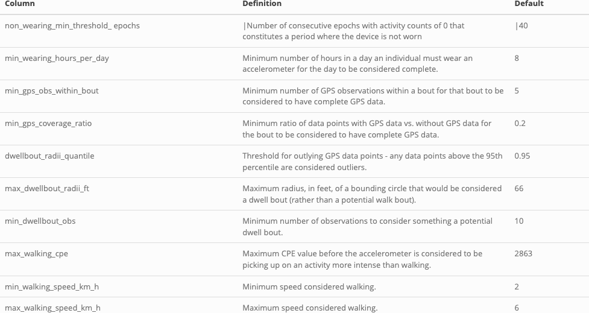
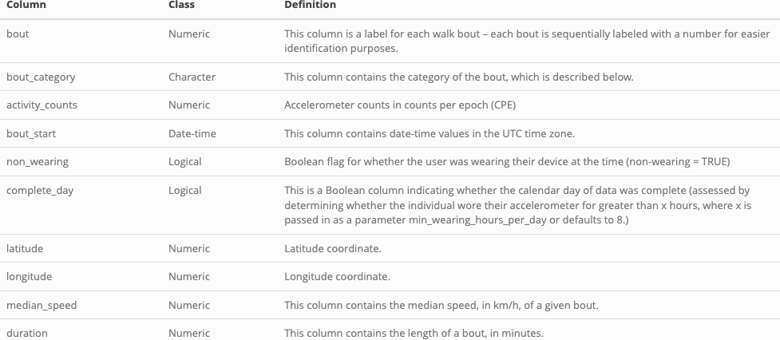
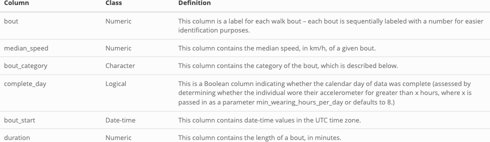
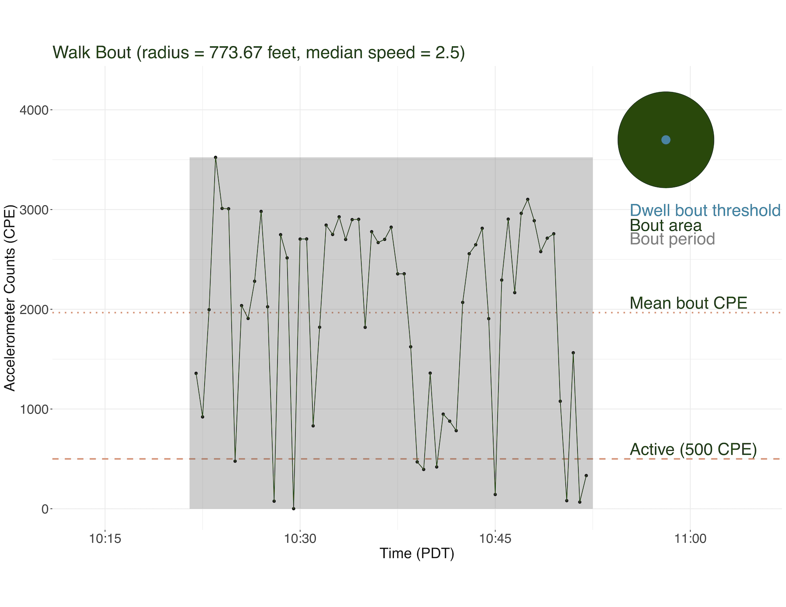

# Summary 
Walking is the most common form of physical activity and a behavior of key interest for urban planners, health promotion researchers, and rehabilitation medicine practitioners. Personal monitoring with accelerometer and Global Positioning System (GPS) devices is the gold standard measurement approach for walking. However, processing accelerometer and GPS device traces to identify walking is a computational and algorithmic challenge. Walkboutr is a new package that allows researchers to process raw accelerometry and GPS traces into standardized walk bouts that can be used to analyze the relationships between urban design, physical activity, and health outcomes. In addition to providing a consistent metric for physical activity analysis, the package de-identifies the original data in a summarized dataset, allowing research groups to use both a full set of data with all identifying information, as well as collaborate on analyses without the ethical and legal complications of working with individually identifiable datasets.

# Introduction

Data collected from monitoring devices such as GPS trackers and accelerometers hold considerable public health research potential `[Feng:2013, Troped:2008]`. By analyzing patterns in individual energy expenditure and movement through space, these data can be used to objectively measure walking, distinct from other forms of physical activity, and its effects, unlocking a researcher’s ability to identify encouragement for and barriers to this key cardioprotective behavior across geospatial contexts and populations `[Kang:2013, Jankowska:2015]`.

In their raw form – a series of timestamps, locations, and accelerometer counts -- monitoring data are rarely of direct researcher interest, and may also (in the case of GPS data) be identifying. It is a challenge to process the data efficiently to identify behaviors of researcher interest (e.g. periods of walking) that may be safely shared across research teams.   Some method to identify travel mode from personal monitoring data (e.g. PALMS,and its successor HABITUS) (https://www.habitus.eu) have processed data on secure servers `[Carlson:2015]`.  Researchers whose privacy agreements with study participants preclude storing data on 3rd party servers may prefer a local R package to identify walking.  To address this gap, we developed a package, `walkboutr`, that implements a previously validated algorithm to extract patterns in monitoring data consistent with walking `[Kang:2013]`.  `walkboutr` allows researchers to (1) process raw personal time stamp-linked GPS and accelerometry data for identifying periods and locations of walking and to (2) create a deidentified summary of walking behavior that can be used in research and practice. 

A walk bout is defined as a period of activity in which an accelerometer trace indicates movement consistent with walking and GPS traces from the corresponding time period indicate movement through space consistent with walking (e.g., based on speed) as well. The inputs of the `walkboutr` package are individual-level accelerometry and GPS data. The output of the package is a data frame integrating all walk bouts (with corresponding times, duration, and summary statistics) identified in those data. A secondary output is a smaller dataset in which all identifying information have been omitted, where this bout summary dataset simply contains a list of all bouts for an individual as well as their corresponding category, median speed, and limited other relevant details. As such, researchers can use either the full dataset that now contains bout labels and categories, or the bout summary, such that all personally identifying information is stripped. The resulting identified bouts can then be used in future research.

By offering a comprehensive set of functions, `walkboutr` empowers researchers and public health practitioners to explore, evaluate, and interpret walk bout data with or without identifying information. This paper introduces the design, features, and potential applications of our R package, highlighting its role in advancing public health research and fostering a deeper understanding of the relationship between physical activity and overall well-being.

# Definition of a walk bout

The idea of a walk bout derives from the physical activity literature, in which monitored time is partitioned into ‘activity bouts’ – periods of time in which the monitored individual is active – and inactive time.  **A walk bout is a physical activity bout in which both activity count range and GPS trace is consistent with walking** `[Kang:2013]`.  

To identify physical activity bouts, we first classify each epoch (see below for a definition of an epoch) as *active* or *inactive* following Troiano et al `[Troiano:2008]`.   Epochs are defined as active if the accelerometer recorded more than 500 counts per epoch (CPE) when epochs were set at 30 seconds long and inactive otherwise (values that are parameterized in the package and can thus be set by the user).  This relatively low threshold compared with other physical activity research was selected to allow for capture of slow walking.

An epoch is technically defined as a discrete time interval at which accelerometers collect data – typically accelerometers collect continuous streams of data and divide them into non-overlapping time windows that are referred to as epochs `[Troiano:2008]`. Within an epoch, the data from the accelerometer is summarized to represent the activity level during that specific time interval `[Troiano:2008]`.

Similarly, CPE refers to the total number of counts that were recorded by the accelerometer within a single epoch duration `[Troiano:2008]`. CPE serve as a fundamental measure of an individual's physical activity level over short time intervals. To calculate CPE for a particular epoch, the raw acceleration data for each axis is usually processed by applying filters or mathematical algorithms to remove noise and gravitational effects. Then, the absolute values of the filtered acceleration readings are summed across all three axes to obtain the total count value for that epoch. Researchers and health professionals use CPE data to assess activity patterns, quantify movement, and study the relationship between physical activity and various health outcomes. Additionally, CPE values are crucial in calibrating accelerometers, setting activity intensity thresholds, and interpreting accelerometer data in different population groups (e.g., CPE threshold values differ in estimating physical activity by age groups).

Next, a physical activity bout is any contiguous set of epochs that:  

* Contains at least 10 cumulative 30-second epochs of being active 
* Begins with an active epoch preceded by at least 4 consecutive 30-second epochs of inactivity (i.e., is not part of a part of a prior active epoch)
* Ends with an active epoch followed by at least 4 consecutive 30-second epochs of inactivity

We can then classify physical activity bouts as walking or not walking based on GPS traces.  A physical activity bout is a walking bout if it:

* is not a *dwell bout* (i.e., a bout in which an individual did not leave a pre-specified radius, determined using the GPS trace (default: 66 feet) `[Kang:2013]`, in feet, indicating that the individual was not moving in space).
* has a median speed consistent with that of walking (specific thresholds configurable and outlined below)
* has sufficient GPS coverage 

# How `walkboutr` works

Figure 1 presents a high-leveled dataflow diagram of how `walkboutr` works. The four modular transformation steps will be described in the following sections as the Accelerometry Process, GPS Process, Walk bout identification, and Summary of walk bouts.

## I. Accelerometry Process

First, from accelerometry data alone, we identify physical activity bouts. These bouts indicate periods of time in which the wearer appears to be physically active, though not necessarily walking (e.g., they could be playing a sport or working out). In order to identify physical activity bouts in accordance with the definition given above, `walkboutr` uses a run-length encoding algorithm to identify subsequences within the accelerometry data where there are 4 or more consecutive epochs where the activity level is above the threshold indicating the individual was active (>500 CPE). Where 4 or more epochs are inactive, the last of those consecutive epochs is by definition not part of a bout (Figure 2). 

{width=100%}

The dataset can then be divided into non-bouts and potential bouts (i.e., subsequences in which a beginning and end of a period need to be identified to determine whether the activity periods extend long enough to be an activity bout).  These potential bouts can then be run-length encoded to identify bouts. Each sequence of epochs that have been identified as potential bouts will have a number of inactive epochs at the end of the series that is equal to the maximum number of consecutive inactive epochs in a bout, a parameter that can be specified by the user but defaults to 3 epochs (or 1.5 minutes for 30s epochs). All potential bouts that were found in this first step are now filtered to only include bouts that have enough epochs to be considered a bout, another parameter that can be specified by the user but defaults to 10 epochs (or 5 minutes). 

If there are no bouts, `walkboutr` stops and returns a message indicating that there are no bouts. If there are more than zero physical activity bouts, `walkboutr` labels each bout with a numeric value. These bouts will later be labeled as either walk bouts or non-walk bouts. 

In addition to finding all bouts in the accelerometry data, `walkboutr` identifies non-wearing periods in the accelerometry data based on a threshold of consecutive epochs with activity counts of 0 CPE. When there are 20 consecutive minutes in which activity counts are 0 CPE, the individual was determined not to be wearing their accelerometry device `[Saelens:2014]`.  These periods are flagged and labeled as non-wearing periods. 

Finally, `walkboutr` determines if the user wore their accelerometer for a sufficient sampling period of 8-hours, also referred as a "complete day." This 8-hour threshold comes preset as a modifiable constant within the `walkboutr` package `[Saelens:2014]`.  `walkboutr` does this by converting time to the local time zone indicated by the user, identifying each full day sequence, and determining if the non-wearing time exceeds 16 hours (24-8 hours). `walkboutr` then creates a flag to designate data points that are associated with a complete day. 

After identifying all physical activity bouts and flagging for non-wearing time, the accelerometry data is ready to be merged with GPS data. 

## II. GPS Process

Incorporating GPS data to classify bouts as walking or not walking requires four steps.  First, `walkboutr` merges GPS and accelerometry data by timestamp.  This merge is complex for two reasons: (1) accelerometry data are typically recorded in local time whereas GPS devices record in UTC time, and (2) whereas accelerometers record activity in consistent epochs from the time they are turned on, GPS devices record when they receive responses from GPS satellites.  A fully launched GPS device pings satellites on a regular schedule, often aligned by design with accelerometer epochs.  However, when devices re-establish connections with satellites (e.g., after a device restart or after time spent in a tunnel), timestamps may be off-alignment.  Accordingly, for each recorded GPS point, `walkboutr` identifies the accelerometer epoch synchronized local time zone of the GPS points (accounting for daylight savings time), then merges the datasets. When multiple GPS points fall within one accelerometer epoch, `walkboutr` will assign the latest GPS point within the epoch to reconcile duplications due to temporal alignment.

Next, `walkboutr` calculates a circle to approximate the distance covered by this bout. The circle is centered at the GPS point cloud median and includes the inner 95% of GPS points. An activity bout is considered a dwell bout (i.e., not walking) if, as mentioned above, the individual does not leave a prespecified and parameterized radius (default setting at 66 feet `[Kang-2013]`), which may indicate they had not left their home, work, etc. The left side of Figure 3 depicts a dwell bout, where the bout radius (green) is circumscribed by the maximum dwell bout radius (pink). A walk-bout (also referred as a non-dwell bout) is depicted on the right in Figure 3, where a bout radius (green) exceeds the maximum dwell bout radius (pink). 

GPS data are then evaluated for completeness based on whether they have a sufficient number of GPS records. This is assessed both in terms of the number of GPS observations within a bout as well as the ratio of observations that have GPS data. By default, a bout has sufficient GPS coverage if it has at least five GPS observations and at least 20% of the epochs have a paired GPS observation. 

Following GPS data assessment, the median speed is calculated for each bout. Median speed of each bout will be interpreted in walk bout identification.

## III. Walk Bout Identification
The final step in `walkboutr` synthesizes the above information and labels each physical activity bout as either a walk bout or a non-walk bout, with a specific label for the different types of non-walk bouts.  Each physical activity bout can have just one category, making the order of labeling important. There are six possible categories into which a bout can fall `[Kang:2013]`. In order, `walkboutr` applies the following labels:
1.	Among all physical activity bouts, bouts without complete GPS data are labeled as a non-walk bout due to incomplete GPS coverage (labeled as **non_walk_incomplete_gps**). 
2.	Among remaining physical activity bouts, bouts where the median speed exceeds the maximum walking speed are labeled as a non-walk bout due to high speed (labeled as **non_walk_too_fast**). As noted in the definition above, walking speed defaults to 6 kilometers per hour.
3.	Among remaining physical activity bouts, bouts where the median speed falls below the minimum walking speed are labeled as a non-walk bout due to low speed (labeled as **non_walk_too_slow**).
4.	Among remaining physical activity bouts, bouts whose mean activity counts (in CPE) are too vigorous to be considered walking (by default, greater than 500 CPE) are labeled as non-walk bout due to high activity (labeled as **non_walk_too_vigorous**).
5.	Among remaining physical activity bouts, bouts whose GPS data do not exceed a bounding radius of 66 feet are labeled as dwell bouts (labeled as **dwell_bout**).
6.	Any remaining remaining physical activity bouts are labeled as walk bouts (labeled as **walk_bout**).

## IV. Summarize Walk bouts

The first function of `walkboutr`, described above, labels walk bouts. After these bouts have been identified and labeled, `walkboutr` collapses and de-identifies all data and a second function can be called to output a summary of identified bouts with spatially identifying information (e.g., GPS points) omitted. Whereas the full dataset maintains all metadata, including identifying GPS information, the summarized dataset includes one row for each bout, which can be freely shared and used collaboratively without risking identifying study participants.

Figure 4 is a summary of the high-level process for this processing: 

# Inputs

`walkboutr` takes in GPS and accelerometry data and processes them to generate walk bouts, using several optional parameters. 

## Accelerometry data
Accelerometry data are collected via accelerometers and are expected to contain two columns – time and activity counts – where time represents date-time values in the UTC time zone and activity (a numeric column) represents counts per epoch, as described above. `walkboutr` expects the user to convert time to UTC time for input this package, but also takes the local time zone as an argument in order to ensure the correct handling of date-time. This format is consistent with the output format from the Actigraph GT3X accelerometer, a device commonly used in research. Refer to Figure 1 for a visualization of accelerometry data. 

The accelerometry data are validated and processed. The processed accelerometry data contain the columns described in Table 1. 

{width=100%}

| Column          | Class    | Definition                                                                                                                                                    |
|------------------|----------|---------------------------------------------------------------------------------------------------------------------------------------------------------------|
| activity_counts | Numeric  | This column contains the activity counts from the original data, in counts per epoch (CPE).                                                                   |
| time            | Date-time| This column contains date-time values in the UTC time zone. (Note: For the determination of the complete_day variable, this column is converted to local time and then back to UTC in order to ensure the correct evaluation of whether a day is complete). |
| bout            | Numeric  | This column is a label for each walk bout – each bout is sequentially labeled with a number for easier identification purposes.                                |
| inactive        | Logical  | This is a Boolean column for whether the activity_counts > 500 CPE, which is the threshold for an individual being considered active.                          |
| non_wearing     | Logical  | This is a Boolean column indicating whether the individual was wearing their accelerometer during that period (assessed by determining if the individual was wearing the accelerometer for x consecutive epochs, where x is passed in as parameter non_wearing_min_threshold_epochs or defaults to 40.) |
| complete_day    | Logical  | This is a Boolean column indicating whether the calendar day of data was complete (assessed by determining whether the individual wore their accelerometer for greater than x hours, where x is passed in as parameter non_wearing_hours_per_day or defaults to 8.) |
**Table 1.** Processed accelerometry data.

## GPS data

Raw GPS data are expected to contain columns time, latitude, longitude, and speed – where time represents date-time values in the UTC and speed is in kilometers per hour.  These data are consistent with the format used by the QStarz BG-1000XT GPS device commonly used in research `[Steel-2021]`.  The GPS data are essential to determining whether an individual has left a given area and is thus walking. In order to assess this, `walkboutr` estimates the distance that an individual has traveled and use that to determine if the individual is likely to have left a given area. If an individual meets the activity count requirements to be considered to be on a walk but does not leave a given location, convention is to label this a dwell bout. A dwell bout may be characterized by an individual walking around their home, walking around their work, etc. – the individual is walking, but the individual is not on a walk. This is an important aspect of measuring walking as it differentiates movement in one space from movement through space {Kang-2013}.   

The processed GPS data consist of a dataset with columns time, longitude, latitude, and speed, where time is now the nearest epoch start time (rather than the precise time stamp of the GPS data point). GPS data are assigned to an epoch start time by rounding down the time associated with the GPS datapoint to the nearest epoch start time.  For example, if epochs in the accelerometry data are 30 seconds, the time associated with a GPS data point will be rounded down to the nearest 30-second increment. If there are multiple GPS datapoints within a single accelerometry epoch, the latest GPS data point in that epoch is used. This allows for the integration of the accelerometry and GPS datasets. The columns described here can be found in Table 2. 

{width=100%}
| Column     | Class    | Definition                                                                                                                                |
|------------|----------|-------------------------------------------------------------------------------------------------------------------------------------------|
| time       | Date-time| This column contains date-time values in the UTC time zone. (Note: this column is now the nearest time that corresponds with an accelerometry epoch, as described above). |
| longitude  | Numeric  | Longitude coordinate.                                                                                                                    |
| latitude   | Numeric  | Latitude coordinate.                                                                                                                     |
| speed      | Numeric  | Current speed in kilometers per hour.                                                                                                    |
**Table 2.** Processed GPS data.

## Constants and parameters

`walkboutr` contains several optional parameters and constants within the package. The constants are pre-set in the package, but the parameters can be adjusted if a user wants to. If a user does not want to adjust any parameters, there is no further specification required. 

The following parameters are optional, and the default value in the absence of a user specifying the parameter, is shown in Table 3. These values can be passed as arguments to the top level functions in the package. 

{width=100%}

| Column                                      | Definition                                                                                             | Default            |
|---------------------------------------------|---------------------------------------------------------------------------------------------------------|--------------------|
| epoch_length                                | The duration of an epoch in seconds.                                                                   | 30                 |
| active_counts_per_epoch_min                 | Minimum accelerometer counts for an epoch to be considered active (vs. inactive).                      | 500                |
| minimum_bout_length                         | Minimum number of epochs for a period of activity to be considered as a potential bout.                | 10                 |
| local_time_zone                             | Local time zone of the data - data come in and are returned in UTC, but local time zone is used to compute complete days. | America/Los_Angeles |
| maximum_number_consec_inactive_epochs_in_bout | Number of consecutive epochs that can be labeled as inactive during a bout without ending the bout.     | 3                  |
**Table 3.** Parameters.

The constants can be found in Table 4.  

{width=100%}

| Column                            | Definition                                                                                                     | Default |
|-----------------------------------|---------------------------------------------------------------------------------------------------------------|---------|
| non_wearing_min_threshold_epochs  | Number of consecutive epochs with activity counts of 0 that constitutes a period where the device is not worn | 40      |
| min_wearing_hours_per_day         | Minimum number of hours in a day an individual must wear an accelerometer for the day to be considered complete. | 8       |
| min_gps_obs_within_bout           | Minimum number of GPS observations within a bout for that bout to be considered to have complete GPS data.    | 5       |
| min_gps_coverage_ratio            | Minimum ratio of data points with GPS data vs. without GPS data for the bout to be considered to have complete GPS data. | 0.2     |
| dwellbout_radii_quantile          | Threshold for outlying GPS data points - any data points above the 95th percentile are considered outliers.   | 0.95    |
| max_dwellbout_radii_ft            | Maximum radius, in feet, of a bounding circle that would be considered a dwell bout (rather than a potential walk bout). | 66      |
| min_dwellbout_obs                 | Minimum number of observations to consider something a potential dwell bout.                                  | 10      |
| max_walking_cpe                   | Maximum CPE value before the accelerometer is considered to be picking up on an activity more intense than walking. | 2863    |
| min_walking_speed_km_h            | Minimum speed considered walking.                                                                             | 2       |
| max_walking_speed_km_h            | Maximum speed considered walking.                                                                             | 6       |
**Table 4.** Constants.

# Outputs

As seen in \autoref{fig:1}, from the processed GPS and accelerometry data, a complete, epoch-level dataset (containing epoch time as date-time in the UTC time zone, accelerometry counts per epoch, latitude, longitude, epoch speed, and wearing day complete flag) is used to create two different output datasets:

The first output is a full dataset (at the epoch level) – this dataset returns all of the original input data that the user provided, in addition to the new columns that `walkboutr` created. This dataset is not de-identified, and thus is appropriate for investigators interested in exploring where people walk (e.g., a walkability analysis) `[Dalmat:2021]`.

The second output is a summarized dataset (at the bout level), which has been de-identified and collapsed to only include summary walk bout information. This dataset is intended to provide essential walking and physical activity metrics without any identifying information – thus serving as a product that can be shared and collaborated upon. This dataset can be used in analyses of walking, merged with other key covariates, and used in research studies of external factors that do or do not increase walking in a population (e.g., neighborhood features and their association with walkability can be merged on prior to deidentification and incorporated after identifying features have been removed) `[Mooney:2020]`. 

The full dataset (at the epoch level) can be seen in Table 5. The summarized dataset (at the bout level) can be seen in Table 6.

{width=100%}

| Column          | Class      | Definition                                                                                                                                                        |
|------------------|------------|------------------------------------------------------------------------------------------------------------------------------------------------------------------|
| bout            | Numeric    | This column is a label for each walk bout – each bout is sequentially labeled with a number for easier identification purposes.                                   |
| bout_category   | Character  | This column contains the category of the bout, which is described below.                                                                                         |
| activity_counts | Numeric    | Accelerometer counts in counts per epoch (CPE).                                                                                                                  |
| bout_start      | Date-time  | This column contains date-time values in the UTC time zone.                                                                                                      |
| non_wearing     | Logical    | Boolean flag for whether the user was wearing their device at the time (non_wearing = TRUE).                                                                     |
| complete_day    | Logical    | This is a Boolean column indicating whether the calendar day of data was complete (assessed by determining whether the individual wore their accelerometer for greater than x hours, where x is passed in as a parameter min_wearing_hours_per_day or defaults to 8.) |
| latitude        | Numeric    | Latitude coordinate.                                                                                                                                             |
| longitude       | Numeric    | Longitude coordinate.                                                                                                                                            |
| median_speed    | Numeric    | This column contains the median speed, in km/h, of a given bout.                                                                                                 |
| duration        | Numeric    | This column contains the length of a bout, in minutes.                                                                                                           |
**Table 5.** Full dataset.

{width=100%}

| Column          | Class      | Definition                                                                                                                                                        |
|------------------|------------|------------------------------------------------------------------------------------------------------------------------------------------------------------------|
| bout            | Numeric    | This column is a label for each walk bout – each bout is sequentially labeled with a number for easier identification purposes.                                   |
| median_speed    | Numeric    | This column contains the median speed, in km/h, of a given bout.                                                                                                 |
| bout_category   | Character  | This column contains the category of the bout, which is described below.                                                                                         |
| complete_day    | Logical    | This is a Boolean column indicating whether the calendar day of data was complete (assessed by determining whether the individual wore their accelerometer for greater than x hours, where x is passed in as a parameter min_wearing_hours_per_day or defaults to 8.) |
| bout_start      | Date-time  | This column contains date-time values in the UTC time zone.                                                                                                      |
| duration        | Numeric    | This column contains the length of a bout, in minutes.                                                                                                           |
**Table 6.** Summarized dataset.

# `walkboutr` Diagnostics

Bouts are categorized into either a walk bout, or one of several other non-walk-bout categories listed above (walk bout, non-walk bout due to slow pace, non-walk bout due to fast pace, non-walk bout due to high CPE, dwell bout, non-walk bout due to incomplete GPS coverage). 

The `walkboutr` package also produces figures describing the walk bouts that are generated, as demonstrated below. This figure below shows a walk bout where the bout is contained within the gray box, where the accelerometry counts exceed the threshold for being considered active. There is also an image of the ratio of radii of the bout and the dwell bout threshold. Given that (1) the activity CPE are consistent with that of walking and (2) the bout area is larger than that of the dwell bout, this is considered a walk bout, this is likely to be a walk bout. `walkboutr` checks to ensure that speed and maximum CPE are consistent with walking (as discussed in the categories above), and then labels this as a walk bout. 

{width=100%}

# Discussion
## Contribution of `walkboutr` to public health research

`walkboutr` allows researchers to evaluate their personal monitoring data using a consistent and precise definition of a walk bout, allowing for research efforts to be focused on the implications of walking. This implementation of the algorithm will aid physical activity researchers in evaluating changes in walking behavior in their populations of interest, thereby facilitating research in this space.  

### An example of `walkboutr` use: TRAC study

Our most recent application of this package is using the TRAC collected data beginning in 2008 with the goal of assessing the ways in which new light-rail changes in King County affected physical activity, particularly walking. Participants in the TRAC study wore a uni-axial or tri-axial accelerometer (GT1M or GT3X Actigraph LLC, Fort Walton Beach, FL) and carried a GPS device (DG-100 GPS data logger, GlobalSat, Taipei, Taiwan or QStarz BT1000-XT) `[Kang:2018]`.  The data from the TRAC study were cleaned and processed to contain the columns required by `walkboutr` and were then processed to identify walk bouts in the data. These walk bouts were then used, for example, to identify whether people walk more near new transit stops `[Huang:2017]`, determine which residential neighborhood features were most correlated with walking `[Mooney:2020]`, and compare walkability metrics to determine which best predicted walking `[Dalmat:2021]`. 

However, the code for walk bout identification for these previous papers was developed only for the TRAC study.  `walkboutr` implements the bout identification algorithm in a re-usable way and deidentifies the data; it allows all researchers to use the same algorithm and share common data, and provides efficient and consistent processing of data to estimate walking. 

## Contribution of `walkboutr` to data privacy and ethics practices

In addition to aiding physical activity researchers in their ability to evaluate walking and thus outcomes with which exposure can be tied, `walkboutr` represents an example of an R package in the public health research space that allows researchers who work with personally identifying and sensitive data to collaborate with other researchers safely and without risk of privacy breaches. 

`walkboutr` does this by collapsing all identifying information within its processing and outputting a dataset that contains all relevant walking information without any personal identifiers, exact GPS coordinates, nor exact accelerometer values – making it impossible to trace any bouts back to individuals.  Given the sensitive nature of GPS and accelerometry data, `walkboutr` thus offers anonymous set of walk bouts upon which researchers may collaborate. For example, it allows researchers looking at walking in King County to collaborate with researchers looking at walking in other counties, as the light-rail continues to expand, in the case of the TRAC study, without any risk of privacy breaches. The ability to de-identify, anonymize, and label GPS data opens many more avenues to collaboration in this space.

# Conclusions and future directions

`walkboutr` enables researchers to leverage data collected from monitoring devices such as GPS trackers and accelerometers to more objectively measure walking behavior and its associated impacts on health across diverse geospatial contexts and populations. 

By implementing a validated algorithm, `walkboutr` facilitates not only the identification of walking periods in a consistent and user-friendly manner, thereby bridging the gap between raw data and actionable insights, but also allows researchers to process complex and identifiable monitoring data into shareable insights. 

As public health research increasingly embraces data-driven methodologies, the `walkboutr` package emerges as a tool for researchers to expand their collaborations and datasets. It may serve as an example of how public health researchers can begin to shift towards a new era of collaborative, privacy-conscious, and data-rich health research. By facilitating the extraction of valuable insights from monitoring data without compromising on privacy nor ethics, the package paves the way for a more informed understanding of human behavior, health, and well-being in the world of big data.  
  

*Acknowledgements: We thank Amy Youngbloom for her contributions and assistance in vetting these methods.*

# References