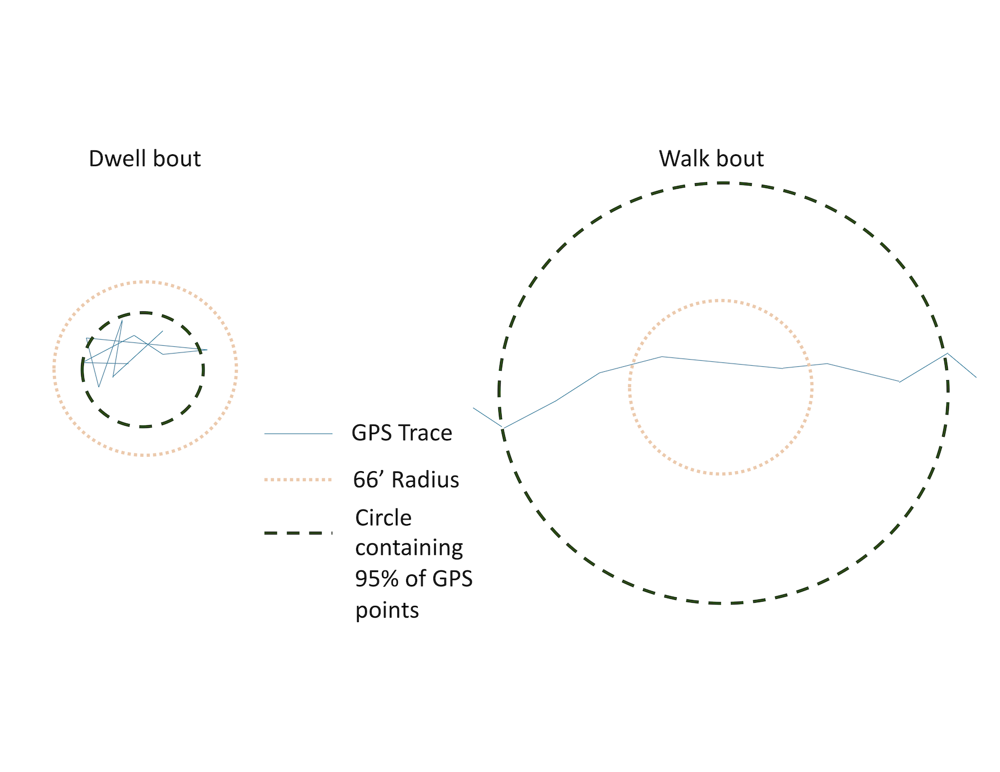
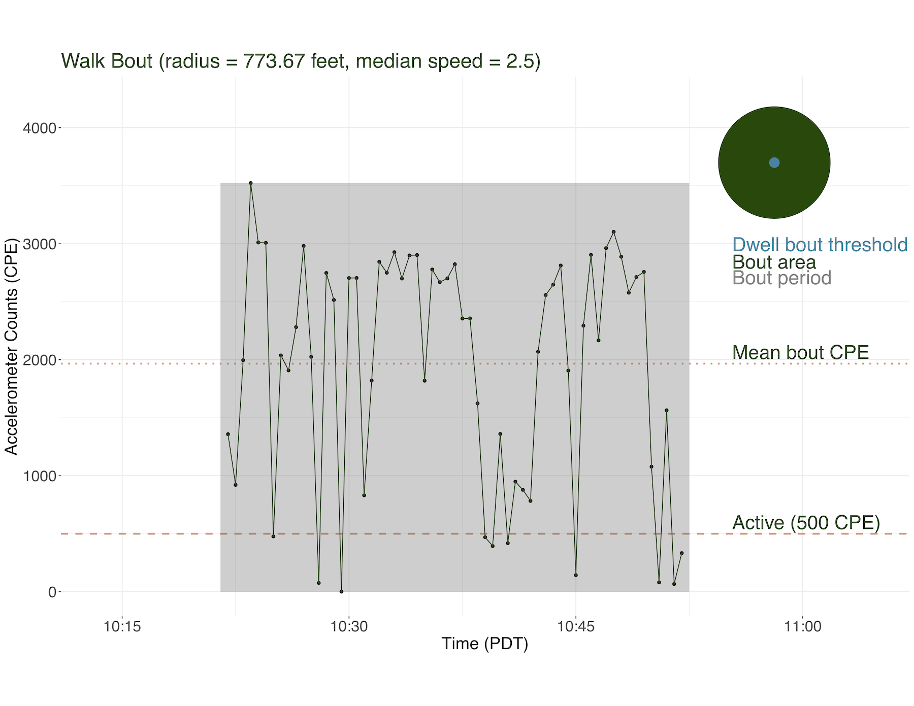

# Walking and Measurement in Public Health Research 

Walking is the most common form of physical activity and a behavior of key interest for urban planners, health promotion researchers, and rehabilitation medicine practitioners.  Data collected from monitoring devices, such as Global Positioning System (GPS) trackers and accelerometers, hold considerable public health research potential `[Feng:2013, Troped:2008]`. By analyzing patterns in individual energy expenditure and movement, these data can be used to objectively measure walking and its effects, unlocking a researcher’s ability to identify encouragement for, and barriers to, this key cardioprotective behavior across geospatial contexts and populations `[Kang:2013, Jankowska:2015]`. 

While GPS devices and acceleremoters provide the gold standard measurement approach for walking, processing accelerometer and GPS device traces to identify walking is a computational and algorithmic challenge. In their raw form – a series of timestamps, locations, and accelerometer counts – monitoring data are rarely of direct researcher interest and may also contain subject-identifying location data. Further, it can be challenging to process these data efficiently to identify behaviors of interest (e.g. periods of walking).  Some methods to identify travel using personal monitoring data (e.g. PALMS,and its successor HABITUS) (https://www.habitus.eu) process data on secure servers `[Carlson:2015]`; however, researchers whose privacy agreements with study participants preclude storing data on 3rd party servers may prefer a local R package.  To address this gap, we developed a package, `walkboutr`, that implements a previously validated algorithm to extract patterns in monitoring data consistent with walking `[Kang:2013]` that may be safely shared across research teams.  `walkboutr` allows researchers to (1) process raw personal time stamp-linked GPS and accelerometry data for identifying periods and locations of walking and (2) create a deidentified summary of walking behavior that can be used in research and practice. 

# Definition of a walk bout

A walk bout is defined as a period of activity in which (1) an accelerometer trace indicates movement consistent with walking (e.g., based on speed) and (2) a GPS traces from the corresponding time period indicate movement through space (e.g., based on distance traveled). The idea of a walk bout derives from the physical activity literature, in which monitored time is partitioned into ‘activity bouts’ and inactive time.  **A walk bout is a physical activity bout in which both activity count range and GPS trace is consistent with walking** `[Kang:2013]`.  

To identify physical activity bouts, the package first classify each non-overlapping discrete time window of accelerometry observations, or epoch, as *active* or *inactive* following Troiano et al `[Troiano:2008]`.  Next, a physical activity bout is any contiguous set of epochs that contains a segment of cumulative active epochs that are preceded and followed by segments of consecutive inactive epochs. These bouts indicate periods of time in which the wearer appears to be physically active, though not necessarily walking (e.g., they could be playing a sport or working out). 

Physical activity bouts are further classified as a *walk bout* or *dwell bout* based on GPS traces.  A dwell bout is a physical activity bout in which an individual did not leave a pre-specified radius `[Kang:2013]`. A walk bout is phyiscial activity bout that is *not* a dwell bout, has a median speed consistent with that of walking, and has sufficient GPS coverage.

## Using the `walkboutr` package
### I. Identifying physical activity bouts

First, observed accelerometry epochs along each axis in three-dimensional space are processed to remove noise and gravitational effects. The total count per epoch (CPE) is calculated as the sum of absolute values across all three axes and epochs with a CPE above a selected threshold are considerd active. For example, epochs 30 seconds in length with a CPE of 500 or higher are classified as *active* by the `walkboutr` package. While threshold is relatively low threshold compared with other physical activity research, it allows for capture of slow walking. (Note: epoch length and CPE threshold can be set by the package user.)

A physical activity bout is identified as a collection of consecutive epochs that is preceded and followed by a collection consecutive inactive epochs. First, the data are divided into potential physical activity bouts and non-bouts using a run-length encoding algorithm to identify subsequences with at least 4 consecutive active epochs. Physical activity bouts are then identified from the potential bouts by filtering to those with 10 consective active epochs preceded and followed by at least 4 inactive epochs, as shown in Figure 1. These threshholds can be changed by the package user if desired. Note, `walkboutr` considers a physical activty bout to include the relevant active epochs and 3 culminating inactive epochs.

{width=100%}

If no bouts are identified, `walkboutr` stops and returns a message indicating that there are no bouts. If there are physical activity bouts, `walkboutr` labels each bout with a numeric value. These bouts will later be labeled as either walk bouts or non-walk bouts. In addition to finding all bouts in the accelerometry data, `walkboutr` identifies non-wearing periods in the accelerometry data when there are 20 consecutive minutes in which activity counts are 0 CPE `[Saelens:2014]`. Finally, `walkboutr` flags whether the subject wore their accelerometer for a "complete day", or provided at least 8-hours of data `[Saelens:2014]`.  As with other parameters, the package user may modify the non-threshholds for flagging non-wearing periods and complete days.

### II. Merging GPS and accelerometer data

Incorporating GPS data to classify bouts as walking or not walking requires four steps.  First, `walkboutr` merges GPS and accelerometry data by timestamp.  This merge is complex for two reasons: (1) accelerometry data are typically recorded in local time whereas GPS devices record in UTC time, and (2) whereas accelerometers record activity in consistent epochs from the time they are turned on, GPS devices record when they receive responses from GPS satellites.  A fully launched GPS device pings satellites on a regular schedule, often aligned by design with accelerometer epochs.  However, when devices re-establish connections with satellites (e.g., after a device restart or after time spent in a tunnel), timestamps may be off-alignment.  Accordingly, for each recorded GPS point, `walkboutr` identifies the accelerometer epoch synchronized local time zone of the GPS points (accounting for daylight savings time), then merges the datasets. When multiple GPS points fall within one accelerometer epoch, `walkboutr` will assign the latest GPS point within the epoch to reconcile duplications due to temporal alignment.

Next, `walkboutr` calculates a circle to approximate the distance covered by this bout. The circle is centered at the GPS point cloud median and includes the inner 95% of GPS points. An activity bout is considered a dwell bout (i.e., not walking) if, as mentioned above, the individual does not leave a prespecified radius (default setting at 66 feet `[Kang-2013]`), which may indicate they had not left their home, work, etc. Figure 2 depicts a walk bout and a dwell bout. 

GPS data are then evaluated for completeness based on whether they have a sufficient number of GPS records. This is assessed both in terms of the number of GPS observations within a bout as well as the ratio of observations that have GPS data. By default, a bout has sufficient GPS coverage if it has at least five GPS observations and at least 20% of the epochs have a paired GPS observation. 

### III. Identifying walk bouts
The final step in `walkboutr` synthesizes the above information and labels each physical activity bout as either a walk bout or a non-walk bout, with a specific label for the different types of non-walk bouts.  Each physical activity bout can have just one category, making the order of labeling important. There are six possible categories into which a bout can fall `[Kang:2013]`. In order, `walkboutr` applies the following labels:    

1.	Among all physical activity bouts, bouts without complete GPS data are labeled as a non-walk bout due to incomplete GPS coverage (labeled as **non_walk_incomplete_gps**). 
2.	Among remaining physical activity bouts, bouts where the median speed exceeds the maximum walking speed are labeled as a non-walk bout due to high speed (labeled as **non_walk_too_fast**). Maximum walking speed defaults to 6 kilometers per hour.
3.	Among remaining physical activity bouts, bouts where the median speed falls below the minimum walking speed are labeled as a non-walk bout due to low speed (labeled as **non_walk_too_slow**). <!-- DMC: what is the default min walking speed? ->
4.	Among remaining physical activity bouts, bouts whose mean activity counts (in CPE) are too vigorous to be considered walking (by default, greater than 500 CPE) are labeled as non-walk bout due to high activity (labeled as **non_walk_too_vigorous**).

<!-- DMC: #4 above. It says earlier that 500 CPE is the cut-off to determine whether an epoch is active or inactive. Shouldn't all walkbouts have epochs with CPE > 500 CPE?    -->

5.	Among remaining physical activity bouts, bouts whose GPS data do not exceed a bounding radius of 66 feet are labeled as dwell bouts (labeled as **dwell_bout**).
6.	Any remaining physical activity bouts are labeled as walk bouts (labeled as **walk_bout**).

###  Producing walk bout datasets for analysis

From the processed GPS and accelerometry data, a complete, epoch-level dataset (containing epoch time as date-time in the UTC time zone, accelerometry counts per epoch, latitude, longitude, epoch speed, and wearing day complete flag) is used to create two different output datasets:

The first output is a full dataset (at the epoch level) – this dataset returns all of the original input data that the user provided, in addition to the new columns that `walkboutr` created. This dataset is not de-identified, and thus is appropriate for investigators interested in exploring where people walk (e.g., a walkability analysis) `[Dalmat:2021]`.

The second output is a summarized dataset (at the bout level), which has been de-identified and collapsed to only include summary walk bout information. This dataset is intended to provide essential walking and physical activity metrics without any identifying information – thus serving as a product that can be easily shared. This dataset can be used in analyses of walking, merged with other key covariates, and used in research studies of external factors that do or do not increase walking in a population (e.g., neighborhood features and their association with walkability can be merged on prior to deidentification and incorporated after identifying features have been removed) `[Mooney:2020]`. 

The full dataset (at the epoch level) can be seen in Table 1. The summarized dataset (at the bout level) can be seen in Table 2.

| Column                   | Class           | Definition                                                                                                   |
|---------------------------|-----------------|-------------------------------------------------------------------------------------------------------------|
| bout                         | Numeric           | This column is a label for each walk bout – each bout is sequentially labeled with a number for easier identification purposes.                                   |
| bout_category                | Character         | This column contains the category of the bout, which is described below.                                                                                         |
| activity_counts              | Numeric           | Accelerometer counts in counts per epoch (CPE).                                                                                                                  |
| bout_start                   | Date-time         | This column contains date-time values in the UTC time zone.                                                                                                      |
| non_wearing                  | Logical           | Boolean flag for whether the user was wearing their device at the time (non_wearing = TRUE).                                                                     |
| complete_day                 | Logical           | This is a Boolean column indicating whether the calendar day of data was complete (assessed by determining whether the individual wore their accelerometer for greater than x hours, where x is passed in as a parameter min_wearing_hours_per_day or defaults to 8.) |
| latitude                     | Numeric           | Latitude coordinate.                                                                                                                                             |
| longitude                    | Numeric           | Longitude coordinate.                                                                                                                                            |
| median_speed                 | Numeric           | This column contains the median speed, in km/h, of a given bout.                                                                                                 |
| duration                     | Numeric           | This column contains the length of a bout, in minutes.                                                                                                           |
**Table 1.** Full dataset.

| Column                   | Class           | Definition                                                                                                   |
|---------------------------|-----------------|-------------------------------------------------------------------------------------------------------------|
| bout                     | Numeric         | This column is a label for each walk bout – each bout is sequentially labeled with a number for easier identification purposes. |
| median_speed             | Numeric         | This column contains the median speed, in km/h, of a given bout.                                            |
| bout_category            | Character       | This column contains the category of the bout, which is described below.                                    |
| complete_day             | Logical         | This is a Boolean column indicating whether the calendar day of data was complete (assessed by determining whether the individual wore their accelerometer for greater than x hours, where x is passed in as a parameter.     min_wearing_hours_per_day or defaults to 8.) |
| bout_start               | Date-time       | This column contains date-time values in the UTC time zone.                                                 |
| duration                 | Numeric         | This column contains the length of a bout, in minutes.                                                      |
**Table 2.** Summarized dataset.

The `walkboutr` package also produces figures describing the walk bouts that are generated, as demonstrated below (Figure 5). This figure shows a walk bout (contained within the gray box) where the accelerometry counts exceed the threshold for being considered active, and an image of the ratio of radii of the bout to the the dwell bout threshold. Given that (1) the activity CPE are consistent with that of walking and (2) the bout area is larger than that of the dwell bout, this is considered a walk bout.  

{width=100%}

# Conclusions and future directions

`walkboutr` enables researchers to leverage data collected from monitoring devices such as GPS trackers and accelerometers to more objectively measure walking behavior and its associated impacts on health across diverse geospatial contexts and populations. 

By implementing a validated algorithm, `walkboutr` facilitates not only the identification of walking periods in a consistent and user-friendly manner, thereby bridging the gap between raw data and actionable insights, but also allows researchers to process complex and identifiable monitoring data into shareable insights. 

As public health research increasingly embraces data-driven methodologies, the `walkboutr` package emerges as a tool for researchers to expand their collaborations and datasets. It may serve as an example of how public health researchers can begin to shift towards a new era of collaborative, privacy-conscious, and data-rich health research. By facilitating the extraction of valuable insights from monitoring data without compromising on privacy nor ethics, the package paves the way for a more informed understanding of human behavior, health, and well-being in the world of big data.  
  

*Acknowledgements: We thank Amy Youngbloom for her contributions and assistance in vetting these methods.*

